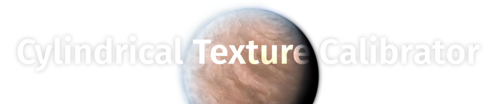
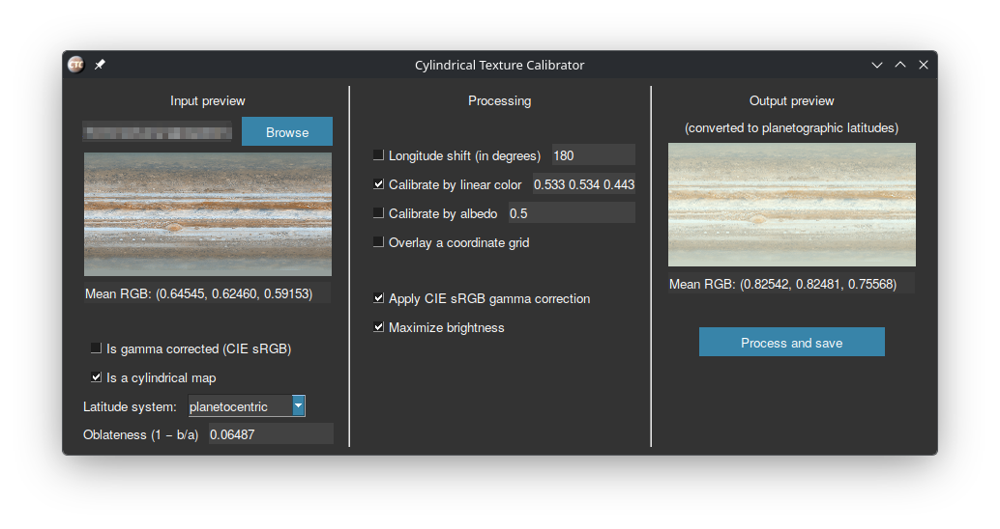

An astronomy-focused Python tool with a GUI that can be used to prepare texture maps of celestial bodies.
The program automates common texture actions that cannot be found in graphics editors, such as reprojection and color/albedo calibration.

CTC may be considered as a complement to the capabilities of [TrueColorTools](https://github.com/Askaniy/TrueColorTools):
1. Disable the `Gamma correction` checkbox on the settings sidebar in TCT
2. Copy the calculated color
3. Paste it to the `Calibrate by linear color` field

## Installation

Cylindrical Texture Calibrator works on Windows and Linux (the GUI library might be unstable on macOS). Python version 3.11 or higher is required.

1. Clone the repository or download the archive using the GitHub web interface;
2. Open the console in the project root folder;
3. Create a virtual environment with `python3 -m venv .venv`;
4. Install the dependencies with `.venv/bin/pip install -r requirements.txt`;
5. Execute `.venv/bin/python runTCT.py`.

### Executable file

An alternative way for Windows 8/10/11. Stable versions are compiled into an executable file, Python installation is not required.

1. Go to [the latest release page](https://github.com/Askaniy/CylindricalTextureCalibrator/releases/latest);
2. Download and unpack the first archive;
3. Launch the `runCTC.exe`.

## Notes

- Gamma correction is an image transformation that lightens shadows and lowers contrast. It is needed to simulate the similar effect of the human eye. Household photos automatically apply gamma correction, but gamma correction is rarely used in the practice of space images processing.
- Albedo and color calibration use a precise formula to calculate mean brightness that accounts for the distortions of planetographic projection.
- The alpha channel is considered a mask. That is, transparent places do not affect the result.
- The albedo calibration is based on green channel brightness. This is the most accurate approximation possible without other spectral data.
- Why could the output latitude system only be planetographic? In the [Celestia space simulator](https://github.com/CelestiaProject/Celestia) this is the projection used for spheroids (for 3D models it is the planetocentric projection).
- Cyclic longitude shift uses the Fourier transform, and as a consequence is subpixelized.

My thanks to *arbodox* for the creation of the project logo.
Thanks to *SevenSpheres* for the Windows releases compilation.
Thanks to the Celestia community for the support.
