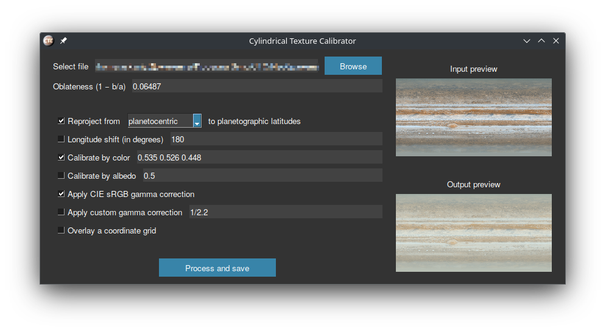

Astronomy-focused Python tool with a GUI to prepare texture maps of celestial bodies.
The program automates common texture actions, most of which can't be found in graphics editors, such as reprojection and color/albedo calibration.

CTC may be considered as a complement to the capabilities of [TrueColorTools](https://github.com/Askaniy/TrueColorTools): you can copy the calculated color (with gamma correction disabled in TCT) and calibrate the texture using it.

## Installation

### Running through Python

Python version 3.10 or higher is required. On Linux, you may need to replace the `python` command with `python3`.

**Step Zero**: Clone the repository or download the archive using the GitHub web interface. In the console, go to the project root folder.

#### Simple installation
1. Install the dependencies with `pip install -r requirements.txt`;
2. Execute `python -u runCTC.py`.

#### In virtual environment
1. Create a virtual environment with `python -m venv .venv`;
2. Install the dependencies with `.venv/bin/pip install -r requirements.txt`;
3. Execute `.venv/bin/python -u runCTC.py`.

### Executable file
[SevenSpheres](https://github.com/SevenSpheres) compiles stable versions of CTC for Windows 8/10/11. Thus, Python is not required in this installation way.
1. Go to [the latest release page](https://github.com/Askaniy/CylindricalTextureCalibrator/releases/latest);
2. Download and unpack the first archive;
3. Launch the `runCTC.exe`.

## Notes

- The operations are applied to the image exactly in the order in which they are listed.
- Gamma correction is an image transformation that lightens shadows and lowers contrast. It is needed to simulate the similar effect of the human eye. Household photos automatically apply gamma correction, but space images only occasionally take it into account. If in doubt which checkbox from the two to choose, choose the CIE sRGB, it works better in shadows.
- Albedo and color calibration use a precise formula to calculate mean brightness that accounts for the distortions of planetographic projection.
- The albedo calibration is actually a green channel calibration. This is the best approximation that can be made without other spectral data.
- Why are reprojections only available to planetographic projection? In the [Celestia space simulator](https://github.com/CelestiaProject/Celestia) this is the projection used for spheroids (for 3D models it is the planetocentric projection).
- Cyclic longitude shift uses the Fourier transform, and as a consequence is subpixelized.
- To de-apply standard gamma correction, you can use "Apply custom gamma correction" item with value `2.2`. But note that every gamma correction operation results in data loss.

My thanks to *arbodox* for the creation of the project logo.
